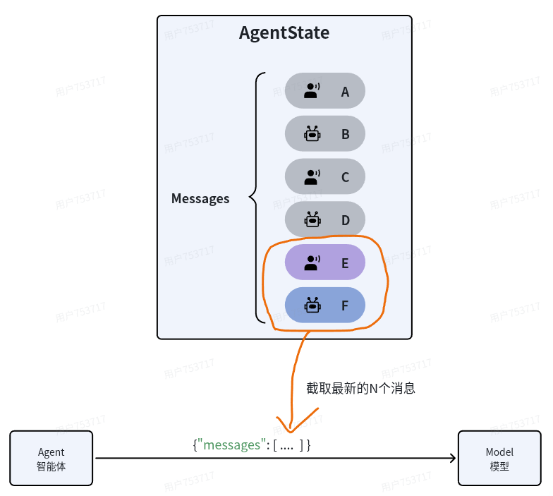
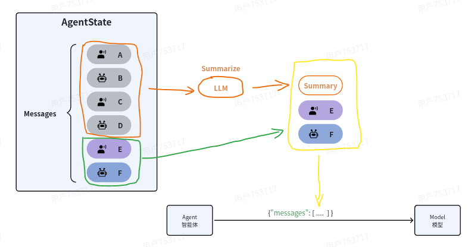

## 1. 模型
### 1.1 初始化模型
#### 1.1.1 init_chat_model
1. 安装模型依赖
```Bash
uv add langchain-deepseek
```
2. 项目的**.env**环境中配置好**api_key**
```Shell
DEEPSEEK_API_KEY=sk-xxxx
```
3. 使用init_chat_model初始化模型
```Python
# 导入Langchain的初始化模型的函数
from langchain.chat_models import init_chat_model
# 加载环境变量
from dotenv import load_dotenv
load_dotenv()

# 调用init_chat_model函数初始化模型，参数model用来指定模型名称，Langchain会根据模型名字自动设定base_url，并从环境变量中获取api_key
model = init_chat_model(model="deepseek-chat")
```
4. 打印model的类型
```Python
print(type(model)) # <class 'langchain_deepseek.chat_models.ChatDeepSeek'>
```
#### 1.2.1 自定义模型及参数

以阿里云百炼的qwen-max为例：

1. 在.env中配置好`api_key`和`base_url`

```
DASHSCOPE_API_KEY=sk-xxx
DASHSCOPE_BASE_URL=https://dashscope.aliyuncs.com/compatible-mode/v1
```

2. 读取环境变量中的`api_key`和`base_url`

```
# 非支持模型无法自动加载环境遍历，我们需要自己加载环境变量中的base_url和api_key
import os

base_url = os.getenv("DASHSCOPE_BASE_URL")
api_key = os.getenv("DASHSCOPE_API_KEY")
```

3. 调用init_chat_model，初始化模型

```
# 初始化模型
model = init_chat_model(
    model="qwen-max", # 模型名称，这里可以自定义，我们用的是阿里的qwen-max
    model_provider="openai", # 如果是Langchain不支持的模型，需要指定模型提供者（虽然我们用的是阿里，但是阿里兼容openai，所以这里用openai，就是默认采用openai的API规范）
    base_url=base_url,
    api_key=api_key
)
```

4. 打印model的类型

```
print(type(model)) # <class 'langchain_openai.chat_models.base.ChatOpenAI'>
```

 其他模型参数：

- temperature: 控制生成文本的随机性，值越小越确定，值越大越随机
- max_tokens: 控制生成文本的最大长度
- top_p: 控制生成文本的多样性，值越小越多样，值越大越确定
- timeout: 控制生成文本的超时时间
- max_retries: 控制生成文本的最大重试次数

```
# 调用init_chat_model函数初始化模型，并设定模型参数
model = init_chat_model(
    model="qwen-max", 
    model_provider="openai",
    base_url=base_url,
    api_key=api_key,
    temperature=1.5,
)
```


### 1.2 访问模型

- invoke：阻塞式访问
- stream：流式访问

#### 1.2.1 invoke

invoke方法是阻塞式调用，需要等待模型生成全部结果才会返回，等待时间较长。

```Python
# 调用invoke方法
response = model.invoke("月亮的首都是哪里？")

# 查看响应结果
print(response)
```

#### 1.2.2 stream

阻塞式调用需要等待较长时间才能看到AI返回的结果，而流式调用则可以实时看到AI返回的一个个词。

示例：

```Python
# 通过.stream方法实现流式访问
stream = model.stream("月亮的首都是哪里？")

# stream调用返回的结果是一个generator，方便我们循环获取结果
print(type(stream))

# 遍历stream结果，实时打印AI的回复
for chunk in stream:
    print(chunk.content, end="", flush=True)
```


### 1.3 在Agent中使用模型

#### 1.3.1 创建智能体

1. 创建智能体，指定模型名，由Langchain初始化模型

```Python
from langchain.agents import create_agent

# 1.指定Model名称，由LangChain自动初始化模型
agent = create_agent(model="deepseek-chat")
```

1. 创建智能体，并使用创建好的model

```Python
from langchain.agents import create_agent
from langchain_community.chat_models.tongyi import ChatTongyi

# 1.使用Model类初始化模型
model = ChatTongyi(
    model="qwen-plus"
    # 其它模型参数...
)

# 2.使用初始化好的model创建智能体
agent = create_agent(model=model)
```

#### 1.3.2 调用智能体

智能体也分为阻塞调用和流式调用两种。

1. 阻塞式调用，使用invoke方法：
   1. ```Python
      # 2.调用模型，需要传入一个消息列表
      response = agent.invoke({
          "messages": [{"role": "user", "content": "月亮的首都是哪里？"}]
      })
      
      print(response)
      ```
2. 流式调用，只需要把调用方式改为`stream`：
   1. ```Python
      for token, metadata in agent.stream(
          {"messages": [{"role": "user", "content": "月亮的首都是哪里？"}]},
          stream_mode="messages"
      ):
          if token.content:  # Check if there's actual content
              print(token.content, end="", flush=True)  # Print token
              # end=""：结尾字符，默认是 "\n"（换行），设为空字符串表示不换行，让后续输出紧跟在后面
              # flush=True：强制立即刷新输出缓冲区，默认 False
      ```

要注意，Agent的stream模式同样返回一个generator，但是其结构由`stream_mode`参数决定：

- messages: 返回LLM生成的每一个片段，是一个包含token和metadata的元组（Tuple）
- updates: 返回Agent运行过程中的每一次事件，例如与LLM的对话、工具的调用等
- custom: 返回通过stream writer记录的每一次自定义的输出

如果是为了流式输出AI返回的结果，使用messages模式即可。


## 2. 消息（Messages）

在调用模型时，发送给LLM的消息、LLM返回的消息都包含以下几部分内容：

- role：消息所属角色，可以是system、user、assistant
- content：消息的内容
- metadata（可选）：消息的元数据，例如：消息的ID、消耗的token等

### 2.1 消息类型

LangChain已经把常见消息根据角色（Role）创建了对应的BaseMessage的子类：

- SystemMessage：role是system，代表系统消息，用于设定模型角色和交互背景
- HumanMessage：role是user，代表用户输入的消息
- AIMessage：role是assistant，代表LLM生成的响应，包含：文本、工具调用、元数据
- ToolMessage：role是tool，代表工具调用时产生的结果

```
from langchain.messages import HumanMessage, AIMessage
from langchain.agents import create_agent

# 创建Agent
agent = create_agent(model="deepseek-chat")

# 调用Agent，发送消息
response = agent.invoke({
    "messages": [
        HumanMessage(content="你好，我是虎哥"),
        AIMessage(content="你好，虎哥，很高兴认识你。"),
        HumanMessage(content="我的名字是什么？")
    ]
})

print(response)

# 通过遍历Messages数组，更友好的打印结果
for message in response['messages']:
    message.pretty_print()
```


### 2.2 多模态消息

#### 2.2.1 在线图片

首先，演示如何发送一个在线图片给模型，也就是指定模型的url地址。

消息格式如下：

```JSON
{
    "role": "user",
    "content": [
        {"type": "image", "url": "https://xxx.com/a.jpeg"},
        {"type": "text", "text": "这些图描绘了什么内容？"}
    ]
}
```

```
from langchain.chat_models import init_chat_model
import os

# 1.初始化模型
model = init_chat_model(
    model="qwen3.5-plus",  # 这里选择qwen3.5-plus，这是一个多模态模型，支持图片、文本、音频、视频
    model_provider="openai",
    base_url=os.getenv("DASHSCOPE_BASE_URL"),
    api_key=os.getenv("DASHSCOPE_API_KEY")
)

# 2.创建智能体
agent = create_agent(model=model)

# 3.组织多模态消息
multimodal_message = HumanMessage(
    content=[
        {"type": "image",
         "url": "https://help-static-aliyun-doc.aliyuncs.com/file-manage-files/zh-CN/20241022/emyrja/dog_and_girl.jpeg"},
        {"type": "text", "text": "这些图描绘了什么内容？"}
    ])

# 4.调用Agent，发送多模态消息
for token, metadata in agent.stream({
    "messages": [multimodal_message]
}, stream_mode="messages"):
    if token.content:
        print(token.content, end="", flush=True)
```

#### 2.2.2 本地图片

所谓本地图片，就是用户上传的图片数据或者本地存在的图片，而不是图片的url地址。需要将图片数据转换成base64字符串，然后发送给模型。

本地图片的消息格式：

```JSON
{
    "role": "user",
    "content": [
        {"type": "text", "text": "Describe the content of this image."},
        {
            "type": "image",
            "base64": "AAAAIGZ0eXBtcDQyAAAAAGlzb21tcDQyAAACAGlzb2...",
            "mime_type": "image/jpeg",
        },
    ]
}
```

```
import base64

# 例如，有一个用户上传的文件，是字节格式img_bytes，我们先将其进行base64编码
img_b64 = base64.b64encode(img_bytes).decode("utf-8")

# 组织多模态消息
multimodal_question = HumanMessage(content=[
    {
        "type": "image",
        "base64": img_b64,
        "mime_type": "image/jpeg",
    },
    {"type": "text", "text": "给我讲讲图片中的城市"}
])

# 调用Agent，发送消息
response = agent.invoke(
    {"messages": [multimodal_question]}
)

print(response['messages'][-1].content)
```


## 3. 提示词（Prompts）

### 3.1 系统提示词 （system prompt）

```
from langchain.agents import create_agent
from langchain.messages import HumanMessage

# 创建智能体
agent = create_agent(
    model = "deepseek-chat",
    system_prompt="像海盗一样说话."
)

for token, metadata in agent.stream(
    {"messages": [HumanMessage(content="你是谁？")]},
    stream_mode="messages"
):
    print(token.content, end="", flush=True)
```


### 3.2 **提示词工程（Prompt Engineering）**

#### 3.2.1 Few-Shot examples

用户只需在输入提示（Prompt）中提供几个输入-输出示例，模型就能理解任务模式并生成符合预期的输出：

```

system_prompt = """
# 身份
- 你是一个科幻作家，根据用户的要求创建一个太空之都。

# 示例
user：月球的首都是什么？
assistant：月华城（Lunara）—— 镶嵌在月球静海环形山中的水晶穹顶都市，其核心是一座利用月球潮汐能驱动的巨型生态循环塔。

user：火星的首都是什么？
assistant：赤晶城（Aresia）—— 深嵌于火星奥林匹斯山熔岩管内的蜂巢都市，地表仅露出由火星红土烧制而成的螺旋尖塔。
"""

# 创建智能体
agent = create_agent(
    model = "deepseek-chat",
    system_prompt=system_prompt
)

for token, metadata in agent.stream(
    {"messages": [HumanMessage(content="金星的首都是什么?")]},
    stream_mode="messages"
):
    print(token.content, end="", flush=True)
```

#### 3.2.2 结构化输出

```
from pydantic import BaseModel
from langchain.agents import create_agent
from langchain.messages import HumanMessage

# 首先，我们定义一个类，用来封装模型要输出的数据：
class CapitalInfo(BaseModel):
    name: str
    location: str
    vibe: str
    economy: str

# 然后，我们就可以创建智能体并设置结构化输出的格式了。
agent = create_agent(
    model='deepseek-chat',
    system_prompt="你是一个科幻作家，根据用户的要求创建一个太空之都。",
    response_format=CapitalInfo # 设置结构化输出的格式
)

response = agent.invoke(
    {"messages": [HumanMessage(content="月球的首都是什么?")]}
)

# 在输出的结果中，有一个'structured_response'的字段，就是结构化输出的对象
city = response['structured_response']

print(f"{city.name}位于{city.location}，是一座{city.vibe}的城市，其主要产业包括{city.economy}。")
```


## 4. 工具（Tools）

### 4.1 基本用法

首先，使用tool装饰器定义工具：

```Python
# 1.使用tool装饰器定义工具
from langchain.tools import tool

@tool
def get_weather(location: str) -> str:
    """
    Get the weather in a given location.
    Args:
        location: city name or coordinates
    """
    return f"Current weather in {location} is sunny"
```

接着，定义Agent，绑定工具：

```Python
from langchain.agents import create_agent
from langchain_core.messages import HumanMessage

# 2.创建智能体，并绑定工具
agent = create_agent(
    model="deepseek-chat",
    tools=[get_weather]
)

# 3.调用Agent
response = agent.invoke(
    {"messages": [HumanMessage(content="杭州今天天气如何?")]},
)

for message in response['messages']:
    message.pretty_print()
```


### 4.2 自定义工具

智能体在工作时，需要将函数的名称、输入、作用传递给大模型，默认情况下这些信息的来源是：

- 工具名称：函数名
- 工具输入：函数入参
- 工具作用：函数的注释

可以通过tool装饰器来覆盖上述信息：

- 通过装饰器定义工具名称

```Python
@tool("square_root")
def tool1(x: float) -> float:
    """Calculate the square root of a number"""
    return x ** 0.5
```

- 通过装饰器定义工具作用描述

```Python
@tool("square_root", description="Calculate the square root of a number")
def tool1(x: float) -> float:
    return x ** 0.5
```

- 通过装饰器定义工具入参约束

如果要覆盖工具的入参信息则会复杂很多，我们要借助于Pydantic或JSON约束。

例如，我们需要定义个查询天气的tool，借助于Pydantic来约束入参。

我们定义一个入参的模型，在模型中添加入参描述信息：

```Python
# 例如一个查询天气的tool
class WeatherInput(BaseModel): 
    """查询天气的输入参数."""
    location: str = Field(description="City name or coordinates")
    units: Literal["celsius", "fahrenheit"] = Field(
        default="celsius",
        description="Temperature unit preference"
    )
    include_forecast: bool = Field(
        default=False,
        description="Include 5-day forecast"
    )
```

- **`class WeatherInput(BaseModel):`**
  定义一个名为 `WeatherInput` 的类，继承自 Pydantic 的 `BaseModel`。`BaseModel` 赋予了该类数据校验、序列化、生成 JSON Schema 等能力。
- **`"""查询天气的输入参数."""`**
  类的文档字符串（docstring），描述该类用途。
- **`location: str = Field(description="City name or coordinates")`**
  - `location: str` 是**类型注解**，声明该字段期望 `str` 类型。Pydantic 会据此进行类型校验。
  - `= Field(...)` 是**默认值赋值语法**，这里并没有直接赋一个字符串，而是使用 Pydantic 的 `Field()` 函数生成字段的元信息（如描述、默认值等）。
  - `Field(description=...)` 为字段附加了描述信息，会被 LangChain 等框架用于生成工具的参数说明。
  - 由于未指定 `default`，`location` 是**必填字段**，调用时必须提供。
- **`units: Literal["celsius", "fahrenheit"] = Field(default="celsius", description=...)`**
  - `Literal["celsius", "fahrenheit"]` 来自 `typing` 模块，限制该字段只能取这两个字面量中的一个。Pydantic 会校验传入值是否在此范围内。
  - `default="celsius"` 表示如果未传入该参数，则使用 `"celsius"` 作为默认值。
  - 因此该字段为可选，默认 `"celsius"`，且必须为这两个值之一。
- **`include_forecast: bool = Field(default=False, description=...)`**
  类型注解为 `bool`，默认值为 `False`，可选字段。

定义工具，使用定义的模型来约束入参：

```Python
# 定义一个查询天气的tool
@tool(args_schema=WeatherInput)
def get_weather(location: str, units: str = "celsius", include_forecast: bool = False) -> str:
    """Get current weather and optional forecast."""
    temp = 22 if units == "celsius" else 72
    result = f"Current weather in {location}: {temp} degrees {units[0].upper()}"
    if include_forecast:
        result += "\nNext 5 days: Sunny"
    return result
```

- **`@tool(args_schema=WeatherInput)`**
  `@` 是**装饰器语法**，等价于：

  ```
  def get_weather(...): ...
  get_weather = tool(args_schema=WeatherInput)(get_weather)
  ```

  `tool` 是一个装饰器函数（通常来自 LangChain），接收参数 `args_schema=WeatherInput`，返回一个装饰器，再作用于下面的函数。
  它的作用是将 `WeatherInput` 这个 Pydantic 模型与 `get_weather` 函数绑定，使得框架可以用该模型校验输入、生成输入 schema、提取参数描述等。

- **参数传递**
  `args_schema=WeatherInput` 是**关键字参数**，在调用装饰器时显式指定 `args_schema` 形参的值为 `WeatherInput` 类。装饰器内部会利用这个模型生成工具的参数结构。

工具定义好之后，调用方式与普通函数类似：

```Bash
# 调用数学工具
tool1.invoke({"x": 467})

# 调用查询天气工具
get_weather.invoke({"location": "杭州", "include_forecast": True})
```

**！！！注意**：

在LangChain中，作为工具的函数**有两个保留的参数名**，你的自定义参数不能与之重复！他们是：

- **config**：用来传递运行时配置
- **runtime**：用来传递运行时上下文

把定义好的工具传递给智能体：

```Bash
from langchain.agents import create_agent

# 创建智能体，并添加工具
agent = create_agent(
    model="deepseek-chat",
    tools=[tool1, get_weather],
    system_prompt="你是一个智能助手，你使用工具来解决用户问题。"
)
```

接下来，调用智能体，向其提问，模型会自动根据用户问题判断：

- 是否需要调用工具？
- 该调用哪个工具？
- 该传递那些参数？

并且在调用工具之后，根据工具执行结果给用户生成响应。

```Python
# 调用智能体
for token, metadata in agent.stream(
    {"messages": [HumanMessage(content="467的平方根是多少?")]},
    stream_mode="messages"
):
    print(token.content, end="", flush=True)
    

for token, metadata in agent.stream(
    {"messages": [HumanMessage(content="北京和杭州接下来几天天气如何?")]},
    stream_mode="messages"
):
    print(token.content, end="", flush=True)
```

如果采用stream模式的updates模式，可以看到工具调用的具体步骤：

```Python
for chunk in agent.stream(
    {"messages": [HumanMessage(content="467、529的平方根是多少?")]},
    stream_mode="updates"
):
    for step, data in chunk.items():
        print(f"step: {step}")
        print(f"content: {data['messages'][-1].content_blocks}")
        print()
```


### 4.3 预定义工具

官网提供的工具：https://docs.langchain.com/oss/python/integrations/tools

Tavily: 专门用于给Agent提供Web搜索的工具。https://www.tavily.com/

```
from pydantic import BaseModel, Field

# Agent回答内容引用的网页信息
class Reference(BaseModel):
    title: str = Field(description="The title of the web page cited in the answer")
    url: str = Field(description="The url of the web page cited in the answer")

# Agent的回答内容
class AnswerInfo (BaseModel):
    answer: str = Field(description="The final answer for user")
    reference: list[Reference] = Field(description="The web pages cited in the answer")
    
# 创建智能体，使用预定义工具tavily
agent = create_agent(
    model="deepseek-chat",
    tools=[web_search],
    system_prompt="你是一个智能助手，你使用工具来解决用户问题。",
    response_format=AnswerInfo
)

# 调用agent
response = agent.invoke(
    {"messages": [HumanMessage(content="蒸蚌是什么梗？")]},
)

# 获取结构化输出
print(response['structured_response'])
```


## 5. 记忆 (memory)

- **短期记忆**：当前任务或会话的上下文（Working Memory 或 Session Memory）
- **长期记忆**：跨任务或会话的**经验与知识**（Persistent Memory）

### 5.1 短期记忆

由于**短期记忆**通常生命周期是当前会话，所以我们也可以称为**会话记忆**。Agent的会话记忆通常包含三部分：

- 对话历史
- 查询结果
- 任务状态

LangChain提供了自动化的记忆管理方案：

- 首先，LangChain把会话记忆（也就是Messages列表）记录为**AgentState**的一部分
- AgentState通过**Checkpointer**对象来保存，每一次与AI的交互都会生成一个快照，记录为一个checkpoint，把同一会话的所有checkpoint组合在一起，就是完整的会话历史了。
- 为了区分不同的会话记忆，不同会话需要设定各自的`thread_id`，相同会话则使用相同`thread_id`
- 向Agent发起会话时必须指定自己的`thread_id`以唤起对应的会话记忆

下面以LangChain提供的基于内存的Checkpointer为例来演示会话记忆。

#### 5.1.1 InMemorySaver

具体步骤是这样的：

1. 导入CheckPointer的内存版实现：
   1. ```Python
      # langchain提供的checkpointer的默认实现，基于内存存储
      from langgraph.checkpoint.memory import InMemorySaver
      ```
2. 创建智能体，设置checkpointer：
   1. ```Python
      from langchain.agents import create_agent
      
      # 创建智能体时指定checkpointer，LangChain会自动帮我们管理历史会话记忆
      agent = create_agent(
          "deepseek-chat",
          checkpointer=InMemorySaver()
      )
      ```
3. 发起调用时，指定thread_id
   1. 第一次调用，告知AI一些信息
   2. ```Python
      from langchain.messages import HumanMessage
      
      # 设定thread_id，作为会话标识
      config = {"configurable": {"thread_id": "thread_1"}}
      
      # 第一次调用，告知AI我的信息
      response = agent.invoke(
          {"messages": [HumanMessage(content="你好，我叫虎哥，我最喜欢猫猫。")]},
          config # 调用时添加thread_id，区分不同会话
      )
      
      print(response)
      ```

   3. 第二次调用，询问AI
   4. ```Python
      # 第二次调用，询问我的信息，这次带上thread_id，唤起记忆
      response = agent.invoke(
          {"messages": [HumanMessage(content="我最喜欢的动物是什么？")]},
          config # 调用时添加thread_id
      )
      
      print(response)
      ```

由于两次调用使用了相同的thread_id，被认定为是同一次对话，所以LangChain会在请求模型时携带历史对话的Messages，模型就能根据历史消息来正确回答了：

```Python
{'messages': [HumanMessage(content='你好，我叫虎哥，我最喜欢猫猫。', additional_kwargs={}, response_metadata={}, id='986d4740-b0dd-4888-ae6a-3eb32454c272'), AIMessage(content='虎哥你好！很高兴认识你！🐯✨  \n喜欢猫猫的人一定都有颗温柔的心呢～你家里有养猫吗？还是喜欢云吸猫？如果聊起猫咪的话题，我可以陪你聊很久哦！😸', additional_kwargs={'refusal': None}, response_metadata={'token_usage': {'completion_tokens': 50, 'prompt_tokens': 15, 'total_tokens': 65, 'completion_tokens_details': None, 'prompt_tokens_details': {'audio_tokens': None, 'cached_tokens': 0}, 'prompt_cache_hit_tokens': 0, 'prompt_cache_miss_tokens': 15}, 'model_provider': 'deepseek', 'model_name': 'deepseek-chat', 'system_fingerprint': 'fp_eaab8d114b_prod0820_fp8_kvcache', 'id': '55e64e65-82dc-4698-9a58-76bad566e953', 'finish_reason': 'stop', 'logprobs': None}, id='lc_run--019ca8cf-ee63-7c81-b5d0-69fdc73b1ae3-0', tool_calls=[], invalid_tool_calls=[], usage_metadata={'input_tokens': 15, 'output_tokens': 50, 'total_tokens': 65, 'input_token_details': {'cache_read': 0}, 'output_token_details': {}}), HumanMessage(content='我最喜欢的动物是什么？', additional_kwargs={}, response_metadata={}, id='c8e7382d-3fa3-44b8-afc6-0ed965ad2abb'), AIMessage(content='根据我们之前的对话，你提到自己“最喜欢猫猫”，所以毫无疑问——你最喜欢的动物是**猫猫**！🐱❤️  \n\n需要聊聊猫咪的品种、趣事，或者分享猫片吗？我随时待命～（笑）', additional_kwargs={'refusal': None}, response_metadata={'token_usage': {'completion_tokens': 53, 'prompt_tokens': 74, 'total_tokens': 127, 'completion_tokens_details': None, 'prompt_tokens_details': {'audio_tokens': None, 'cached_tokens': 64}, 'prompt_cache_hit_tokens': 64, 'prompt_cache_miss_tokens': 10}, 'model_provider': 'deepseek', 'model_name': 'deepseek-chat', 'system_fingerprint': 'fp_eaab8d114b_prod0820_fp8_kvcache', 'id': '10f6fec4-764c-49a7-bb9d-2fa45c08fbfb', 'finish_reason': 'stop', 'logprobs': None}, id='lc_run--019ca8d0-dfe3-7e43-8be2-bcf669aa95e1-0', tool_calls=[], invalid_tool_calls=[], usage_metadata={'input_tokens': 74, 'output_tokens': 53, 'total_tokens': 127, 'input_token_details': {'cache_read': 64}, 'output_token_details': {}})]}
```

#### 5.1.2 持久化Memory

LangChain也提供了很多持久化存储的checkpointer，例如：

- SqlLiteSaver ：基于sqlite存储
- PostgresSaver ：基于Postgres存储
- CosmosDBSaver ：使用Azure Cosmos DB的实现

文档：https://docs.langchain.com/oss/python/langgraph/persistence#checkpointer-libraries

以SqlLiteSaver 为例来讲解如何自定义Memory存储方案。

**首先**，安装对应依赖：

```Bash
# pip安装
# pip install langgraph-checkpoint-sqlite

# uv安装
uv add langgraph-checkpoint-sqlite
```

**然后**，导入以来，并初始化sqlite-checkpointer

```Python
import sqlite3
from langgraph.checkpoint.sqlite import SqliteSaver

# 初始化checkpointer
checkpointer = SqliteSaver(sqlite3.connect("checkpoint.db", check_same_thread=False))
# 自动建表
checkpointer.setup()
```

**最后**，创建Agent，并设置checkpointer：

```Bash
# 创建agent
agent = create_agent(
    "deepseek-chat",
    checkpointer=checkpointer,
)
```


### 5.2 记忆管理策略

官网文档：https://docs.langchain.com/oss/python/langchain/short-term-memory#common-patterns

#### 5.2.1 修剪消息

修剪消息并不是真正的删除消息，在AgentState中的消息列表依然是完整的，只不过发送给LLM之前会进行修剪，只保留一部分消息。


#### 5.2.2 删除消息

删除消息与修剪不同：

- 修剪消息：只是从State中选取一部分消息发送给模型
- 删除消息：直接删除State中保存的消息，也就是说消息历史中不再存

#### 5.2.3 总结消息

不管是修剪还是删除，都会导致一部分消息丢失，从而丢失记忆。所以就有了第三种策略：**总结消息（Summarize Messages）**

它的思路很简单，就是把历史的消息利用大模型总结出摘要，然后把最新的消息拼接在一起作为新的消息列表发送给大模型，这样既不会超出模型的上下文窗口限制，还能尽量保留所有的记忆。



LangChain提供了总结消息的默认实现：**SummarizationMiddleware**

使用方法：

1. 初始化SummarizationMiddleware和checkpointer
   1. ```Python
      from langchain.agents import create_agent
      from langchain.agents.middleware import SummarizationMiddleware
      from langgraph.checkpoint.memory import InMemorySaver
      from langchain_core.runnables import RunnableConfig
      
      # 初始化checkpointer
      checkpointer = InMemorySaver()
      # 初始化中间件
      middleware = SummarizationMiddleware(
          model="deepseek-chat",
          trigger=("messages", 3), #  触发时机，当消息数超过3时，进行总结
          keep=("messages", 1) #  保留的会话数，超过2条
      )
      ```

   2.  注意这里SummarizationMiddleware的参数（详细内容参考官网链接：[summarization](https://docs.langchain.com/oss/python/langchain/middleware/built-in#summarization)）：

   3. model：会话摘要时要使用的模型
   4. trigger：会话摘要的触发时机，有三种设置：
      - `fraction` (float): 模型上下文大小的比例（0-1）
      - `tokens` (int): 令牌数量
      - `messages` (int): 消息数量
   5. keep：是指触发摘要后要保留的消息
      - `fraction` (float): 要保留的消息占模型上下文大小的比例（0-1）
      - `tokens` (int): 要保留的消息的令牌数量
      - `messages` (int): 要保留的消息数量
2. 创建Agent，设置middleware和checkpointer
   1. ```Python
      # 创建agent
      agent = create_agent(
          model="deepseek-chat",
          middleware=[middleware],
          checkpointer=checkpointer,
      )
      ```
3. 调用Agent即可
   1. ```Python
      config: RunnableConfig = {"configurable": {"thread_id": "1"}}
      # 制造长会话历史
      agent.invoke({"messages": "你好，我是虎哥."}, config)
      agent.invoke({"messages": "我最喜欢的运动是乒乓"}, config)
      agent.invoke({"messages": "我最喜欢的动物是猫猫"}, config)
      # 测试效果
      final_response = agent.invoke({"messages": "你还记得我吗？"}, config)
      
      
      for message in final_response["messages"]:
          message.pretty_print()
      ```

测试结果：

```Python
================================ Human Message =================================

Here is a summary of the conversation to date:

用户名为“虎哥”。最喜欢的运动是乒乓球。最喜欢的动物是猫。AI已询问用户打乒乓球的时长、偏好（单打/双打）以及是否有喜欢的运动员。AI也已询问用户是否养猫或“云吸猫”。用户尚未回答关于乒乓球的后续问题。
================================ Human Message =================================

你还记得我吗？
================================== Ai Message ==================================

当然记得，虎哥！你最喜欢的运动是乒乓球，最喜欢的动物是猫。之前我们聊到一半，还在等你分享打乒乓球的细节呢——比如打了多久、喜欢单打还是双打，有没有崇拜的运动员？另外也很好奇你是有自己的猫，还是喜欢“云吸猫”？

今天想继续聊乒乓球，还是想聊聊猫？或者有其他新话题？ 😄
```

