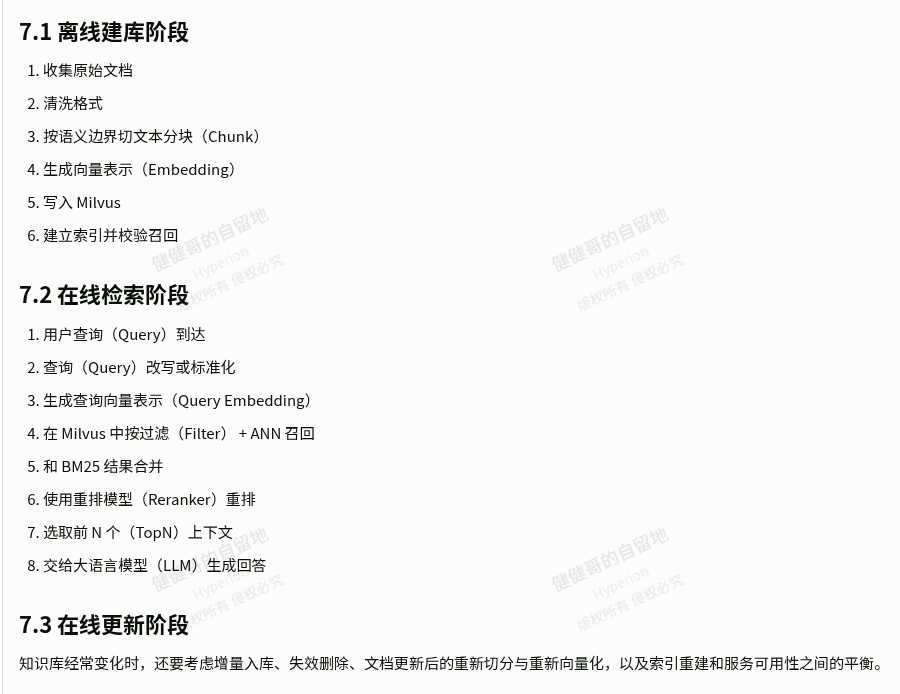
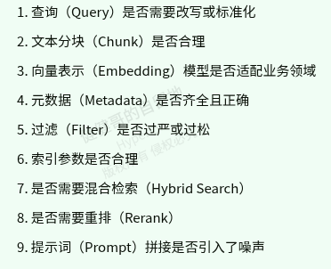

## 术语说明

Cosine：余弦相似度

Inner Product：内积

L2：欧式距离

ANN：近似最近邻

IVF：倒排文件索引

HNSW：分层可导航小世界图

PQ/SQ：乘积量化/标量量化

FLAT：暴力精确检索

IVF+PQ：分桶加乘积量化

Metadata：元数据

Chunk：文本分块

**Milvus：**一种向量数据库

## 学习笔记

参考资料：https://jianjiange.site/

### RAG中向量数据库学习指南：基础理论、Milvus深入实践与面试要点

#### 典型的Milvus + RAG 实战链路

#### 面试高频问题与答题要点

**基础题：**

* 什么是向量数据库，它和传统数据库有什么区别？

传统数据库擅长精确匹配和结构化查询；向量数据库擅长高维向量的相似性搜索。

* RAG为什么需要向量数据库？

RAG需要从外部知识库中按语义召回相关内容。文本和查询（query）都会先Embedding成向量，向量数据库负责高效找到最相似的文档片段。

* 向量数据库是不是只存向量？

不是。还有主键、原文、文档ID、业务标签、权限标签、时间戳等元数据（Metadata）；线上可用性高度依赖过滤能力。

* 余弦相似度（Cosine）、内积（Inner Product）、欧式距离（L2）的区别

余弦相似度（Cosine）看方向夹角，内积（Inner Product）看内积大小，欧式距离（L2）看欧式距离。实际选择要与模型训练方式和归一化策略匹配。

* 什么是ANN，为什么不用精确搜索？

大规模精确搜索慢、成本高。ANN用近似方法换取更快的检索速度，本质是召回率（ReCall）、延迟（Latency）、成本（Cost）的平衡。

**进阶题：**

* HNSW 和 IVF  的区别是什么？

IVF基于聚类分桶，HNSW基于图导航。HNSW常有更好的召回与性能表现，但内存成本更高；

IVF 更容易从桶与探测数理解调参。

* Chunk为什么会影响RAG效果？

文本分块（Chunk）太大语义混杂，太小上下文不足。文本分块（Chunk）粒度会直接影响Embedding表达和召回质量。

* TopK 怎么定？

没有固定值，结合数据类型、召回率、重排（Rerank）能力、上下文窗口和最终问答效果来定。

常见做法是第一轮召回（first recall）较大，最终送给大预言模型（LLM）的文本分块（Chunk）数较小。

* Milvus中Collection、Partition、Segment分别是什么？

集合（Collection）是逻辑表，分区（Partition）是逻辑分区，数据分段（Segment）是底层数据组织和调度的重要单位。

* Milvus写入后为什么不一定立刻达到最佳检索状态？

写入、刷盘（Flush）、索引构建、加载（Load）是不同阶段；数据可见、索引可见、性能最优通常不是同一时刻完成。

**排障题：**

* RAG检索效果不好时怎么排查？

